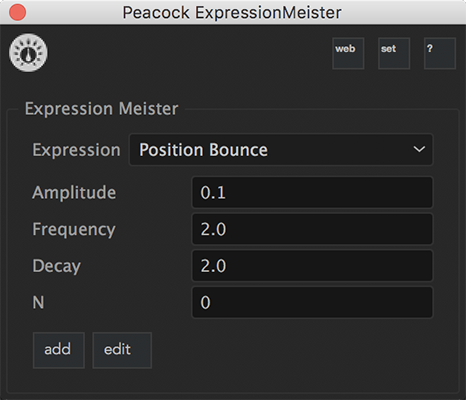
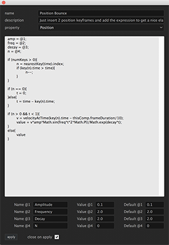
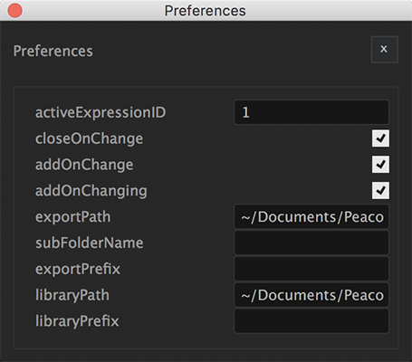
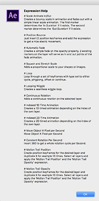
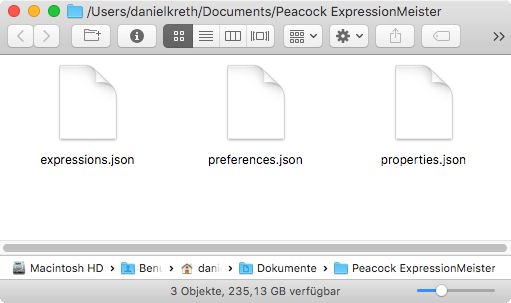

Peacock AE ExpressionMeister
-----------------------------

.. contents:: Table of Contents

~~~~~~~
History
~~~~~~~

.. sidebar:: Main Window

    .. image:: ../../modules/expressionmeister/images/ExpressionMeister_01_400px.png

    Main Window

    The expression is updating while you are typing value into the edit fields
    and you can see the changes live

Maybe you have a similar problem with expressions in After Effects like me.
I used to work as a motion graphics designer for a tv station and my task was to create many little motion graphics movies per day.
I found myself using the same techiniques over and over again like for example creating a simple in animation for all the icons and pictorgrams etc.

As I've got more into expressions I figured that I could make my life much more easier by having a nice collection of little expression that would save me some mouse clicks per day.
Of course my collection of expressions were saved somewhere on my computer in a .txt file and it was kind of a pain to always skim through the finder and find the expression I was looking for.

The first script I created to help myself with this dilemma was just a small panel with a button to insert the one and only scaling expression that me and my colleagues were using the most.
After one of my colleagues came to me and told me that my little script was so helpful and that he was using it everyday, I collected some more feedback and started developing a script that would satisfy all needs of my colleagues and me.

During the development process I thought a lot about how I can make this script as flexible and useful for as many people as possible and I came up with the **Expression Meister**.

~~~~~~~~
Features
~~~~~~~~

- 10 pre defined expressions that are completly editable after your liking.
- .

Main Window
===========

    Main Window
    The expression is updating while you are typing value into the edit fields
    and you can see the changes live

Edit Expression Window
======================

    Edit Expression Window
    When its time to modify your expressions you can simply open the edit expression window.
    If everything is perfectly setup you possibly won't need this window in a long while.

The Preferences Window
======================

    Preferences Window
    The preference window is a comfortable alternative to editing the preference file with any text editor

The Help Window
===============

    Help Window
    In the help window you will find all expression descriptions you've set for your expression in a list

~~~~~~~~~~~
Flexibility
~~~~~~~~~~~

All your customizations, expressions and preferences are stored in one location which makes it easy for you to backup you settings and use them on several working places:

Those files are stored in the users documents folder:

- Win: ``C:\Users\(User_Name)\Documents\Peacock ExpressionMeister``
- Mac: ``~/documents/Peacock ExpressionMeister``

    The ExpressionMeister preference folder in ``~/documents/Peacock ExpressionMeister``.

The ``preferences.json`` file::

  {
    "activeExpressionID": 0,
    "closeOnChange": false,
    "addOnChange": true,
    "addOnChanging": true
  }

The ``properties.json`` file::

  [
    {
      "name": "Anchor Point",
      "group": "ADBE Transform Group",
      "matchName": "ADBE Anchor Point"
    },
    {
      "name": "Position",
      "group": "ADBE Transform Group",
      "matchName": "ADBE Position"
    },
    {
      "name": "Scale",
      "group": "ADBE Transform Group",
      "matchName": "ADBE Scale"
    },
    {
      "name": "Rotation Z",
      "group": "ADBE Transform Group",
      "matchName": "ADBE Rotate Z"
    },
    {
      "name": "Opacity",
      "group": "ADBE Transform Group",
      "matchName": "ADBE Opacity"
    },
    {
      "name": "x Position",
      "group": "ADBE Transform Group",
      "matchName": "ADBE Position_0"
    },
    {
      "name": "y Position",
      "group": "ADBE Transform Group",
      "matchName": "ADBE Position_1"
    }
  ]

The ``expressions.json`` file.
The following block shows only one expression as an example to show how an expression is saved and structured.

.. code:: javascript

  [
    {
      "name": "Scale Animate In/Out",
      "description": "Creates a bouncy scale in animation and fades out with a simple linear scale animation. The first marker determines the 'In Duration' if it exists. The second marker determines the 'Out Duration' if it exists.",
      "parameterNames": [
        "Frequency",
        "Decay",
        "End Value",
        "In Duration",
        "Out Duration"
      ],
      "parameterValues": [
        "2",
        "12",
        "100",
        "0.1",
        "0.1"
      ],
      "defaultParameterValues": [
        "2",
        "12",
        "100",
        "0.1",
        "0.1"
      ],
      "property": "Scale",
      "text": "freq = @1;\ndecay = @2;\nt = time - inPoint;\nout = outPoint - inPoint;\nstartVal = [0,0];\nendVal = [@3, @3];\n\nin_dur = (marker.numKeys>0) ? marker.key(1).time : @4;\nout_dur = (marker.numKeys>1) ? out-marker.key(2).time : @5;\n\n\nif (t < in_dur){\n\tlinear(t, 0, in_dur, startVal, endVal);\n}\nelse if(t > (out-out_dur)){\n\tlinear(t, (out-out_dur), out, endVal, startVal);\n}\nelse{\n\tamp = (endVal - startVal)/in_dur;\n\tw = freq*Math.PI*2;\n\tendVal + amp*(Math.sin((t-in_dur)*w)/Math.exp(decay*(t-in_dur))/w);\n}"
    }
  ]

---------

~~~~~~~~~~~~
Preparations
~~~~~~~~~~~~

``After Effects -> Preferences -> General -> Allow Scripts To Write Files And Access Network``
(``Skripte können Dateien schreiben und haben Netwerkzugang``)

.. figure:: ../../modules/expressionmeister/images/AE_Preferences_en_small.png
   :align: center