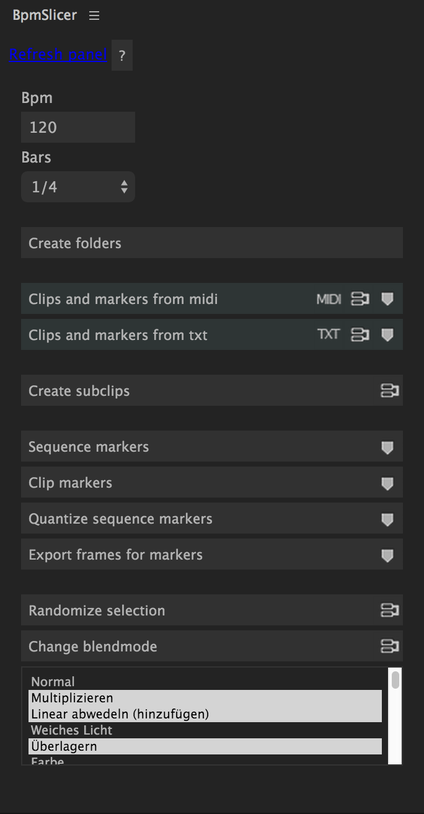
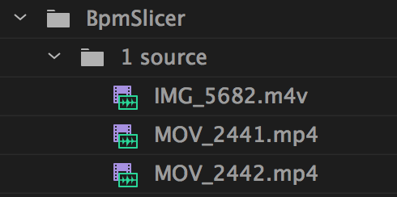
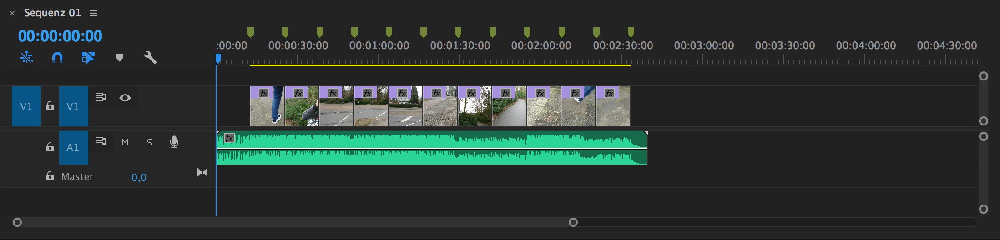
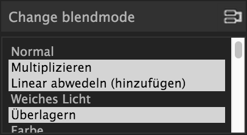
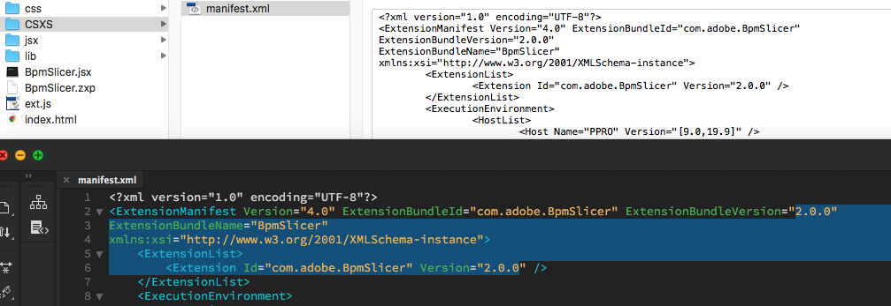

Peacock PPRO BpmSlicer
----------------------

    Premiere Pro BpmSlicer.

A manual for the Premiere Pro extension

This extension is designed for creatively making music videos by developing a special midiclip along with your music production that helps you later in the video editing process.

Primarily this extension is made for music producers who are familiar with midi and the bpm value of a song.

Nevertheless you are not into music production and don't know how to create midiclips you can still use the other functionallity of this extension.

But you need to take a deeper look at the Preparations_.

Here you can find the |Premiere_Scripting_Guide|.

---------

.. contents:: Table of Contents

---------

.. _Installation:

************
Installation
************

.. _Download the extension (.zxp file):

Download the extension (.zxp file)
==================================
When you download the extension, it comes as a zxp file to your computer's Downloads folder.
Enter any passwords, or accept any notices your computer’s operating system presents.

.. _Extension Install Utility:

Extension Install Utility
=========================
If you were unable to install your extension using the Creative Cloud desktop app,
please follow the instructions below to use an extension install utility.
In addition to Adobe's Manage Extensions utility there are various third party utilites
available that work with Adobe .zxp files, such as Anastasiy’s Extension Manager or |ZXPInstaller|.

Open the Extension Install Utility.
If you don’t have it on your computer, below are download links for alternative utilities.
Once downloaded and installed, use an extension install utility to install your .zxp files.

- Manage Extensions utility
- Anastasiy’s Extension Manager
- |ZXPInstaller|

After selecting either the Mac or Windows version of your chosen Extension Install Utility,
download it to your computer and follow the installation instructions from the installer,
which should be in your Downloads folder.

Install your extension from Adobe Exchange by selecting File > Install extension or
following the instructions within the install utility and selecting the extension
from within your computer’s Downloads folder.

Do not use Adobe Extension Manager for CC2015 or later compatible Adobe apps.
It is no longer supported and may create install issues. Use a third party utility
for extension installation, such as those mentioned above for installation,
if installation via the Creative Cloud desktop app is not successful.

.. |ZXPInstaller| raw:: html

   <a href="https://zxpinstaller.com/" target="_blank">ZXPInstaller</a>

.. _ExMan Command Line Tool:

ExMan Command Line Tool
=========================

You can even go a step further and use the command line tool |ExManCmd|.

1. Copy the ZXP package to ExMan_root. Let’s call it myextension.zxp.

2. Close any Adobe applications that are compatible with the Extension.

3. In a command shell (Mac OS Terminal or Windows Command Prompt), go to the ExMan_root folder and run this command for your extension:

  - In Mac OS: ``./Contents/MacOS/ExManCmd ––install myextension.zxp``
  - In Windows: ``ExManCmd.exe /install myextension.zxp``

    .. Note:: Currently, ExManCmd does not support encrypted extensions for enterprise use cases.

4. Check Where to Find it - Follow the instructions in the “Where to find it” section on the detail page. Some extensions may require you to carry out further steps to install.

This should install the add-on. You can verify the installation with this command:

- In Mac OS: ``./Contents/MacOS/ExManCmd ––list all``
- In Windows: ``ExManCmd.exe /list all``

.. |ExManCmd| raw:: html

   <a href="https://partners.adobe.com/exchangeprogram/creativecloud/support/exman-com-line-tool.html" target="_blank">ExManCmd</a>

.. _Where to Find it:

Where to Find it
================
After the installation you can find the extension placed in the extension folder.

- Windows: ``C:\Program Files (x86)\Common Files\Adobe\CEP\extensions``
- Mac: ``/Library/Application Support/Adobe/CEP/extensions``

**Resources:**

-  |adobeexchange_install_instructions|

.. |adobeexchange_install_instructions| raw:: html

   <a href="https://www.adobeexchange.com/creativecloud/install-instructions.20513.html" target="_blank">https://www.adobeexchange.com/creativecloud/install-instructions.20513.html</a>

---------

.. _Preparations:

************
Preparations
************

Before you can take full advantage of the functionality of the BpmSlicer you need to prepare your footage as follows.

.. _Song preparation:

Song preparation
================
You have to ensure that the following two conditions are met:

- You need to know the exact bpm value of the song you want to work with and set this value in the Bpm_ input field.

- You need to make sure that the 1 beat of the song sits exactly at the 0 point in time.

Some songs may not have an intro that fits the bpm rate of the actual song, then you
need to find the first beat and place it accordingly.

If you have the exact bpm rate of the song then it won't be too difficult to make it fit.

.. _Preparing the midi clip:

Preparing the midi clip
=======================

The best way to create a midi clip for the BpmSlicer is to have in mind what will happen later in Premiere Pro with it.
Basically what we are trying here is to convert a midi note to a video clip.
The following table shows the mapping of the midi properties to the properties of the video clip.

================  =====================================================================
Midi Note         Video Clip
================  =====================================================================
``track``         The prefix that determines which footage can be used for the clip.
``noteOn``        The clips in point in the active sequence.
``noteOff``       The clips out point in the active sequence.
``velocity``      A value between 0.0 - 1.0 sets the start time of the current clip.
================  =====================================================================

While ``noteOn`` and ``noteOff`` is self explaining ``track`` needs a little more detailed explanation.

The ``velocity`` is exponentially interpreted which means it is easier to make tiny adjustment (Exponent is 3).

---------

You can control the ``track`` property in the midi file by adjusting the midi note value of the midi note (Possible midi note values would be for example C3, D4, A#4 etc.).

Because I figured you only need a hand full of tracks in video production, I specified a range of midi note values in order to set the corresponding ``track``.

.. figure:: ../../modules/ppro_bpmslicer/images/MidinoteRange.png
    :align: center

    Midinote range that will set the ``track`` property to other than ``0``.

================  =========
Midi Note         Track
================  =========
...               0
B2                0
``C3``            ``1``
``C#3``           ``2``
``D3``            ``3``
...               ...
``A#3``           ``11``
``B3``            ``12``
C4                0
...               0
================  =========

.. _Midi Modulations:

Midi Modulations
================

Modulations are also included in a midi file and can be accessed to manipulate video clips.

If any of the envelopes in the list below are set in the midi file, they are available in Premiere Pro.
Note that not every envelope has a function yet.

The modulation evelopes in the midi file so as the velocity of a midi note have values between 0 - 127.
In Premiere Pro these values are getting mapped to a value range of 0.0 - 1.0.

The following list shows all available midi envelopes including the velocity with a description about how they are used.
Entries that have no description are not mapped to any function in Premiere Pro yet.

.. note:: If the value of an envelope event in the midifile is 63 it is getting mapped to 0.5 which is exactly the center point. This is important when you use the ``pitch bend`` in order to control the scaling where 0.5 (63) is exactly 100% which probably is your default scaling value you want to use.

    This also applies to the ``controller`` and ``footpedal`` envelopes that are getting mapped to the x- and y-Position.

``velocity``
  Sets the **opacity** of the current clip::

    opacity = velocity * 100

``pitch bend``
  Sets the **scale** of the current clip::

    scale = pitchbend * 200

``1 modulation``
  Sets the **start time** of the current clip::

    startTime = map(modulation, 0.0, 1.0, 0.0, (footage_duration - note_duration))

``2 breath``
  Sets the **rotation** of the current clip::

    rotation = breath * 360

``3 controller``
  Sets the **x position** of the current clip::

    xPosition = controller

``4 footpedal``
  Sets the **y position** of the current clip::

    yPosition = footpedal

``5 portamento time``
  Sets the **x anchor** of the current clip::

    xAnchor = portamentotime

``6 data entry``
  Sets the **y anchor** of the current clip::

    yAnchor = dataentry

``7 volume``
  Not set yet::

    .

``8 balance``
  Not set yet::

    .
``9 controller``
  Not set yet::

    .
``10 pan``
  Not set yet::

    .
``11 expression``
  Not set yet::

    .
``12 effect control 1``
  Not set yet::

    .
``13 effect control 2``
  Not set yet::

    .

.. note::

    - ``footage_duration`` is the duration of the original video file.
    - ``note_duration`` is the duration of the current midi note.

.. _Preparing your footage in Premiere Pro:

Preparing your footage in Premiere Pro
======================================

.. sidebar:: Footage Interpretation

    .. image:: ../../modules/ppro_bpmslicer/images/premiere_interpretfootage1.png

    .. image:: ../../modules/ppro_bpmslicer/images/premiere_interpretfootage2.png

    If you want to adjust the speed of your footage you can do so by adjusting the footage interpretation.
    Note that if you adjust the speed of the footage the BpmSlicer can not interpret the footage correctly.

If there is no BpmSlicer folder structure already you can create one by clicking the `Create Folder Structure`_ Button::

    BpmSlicer
        1 source
        2 subclips

Put all your footage you want to be placed into the active sequence
into the ``1 source`` folder and assign the appropriate prefix for each footage item.

Make sure the prefix is a number between 1 - 12 and make sure there is a white space between the prefix number and the footage name.

Lets assume you have named your footage in the ``1 source`` folder as displayed below::

    1 source
      1 clip_1.mov
      1 video_10.mp4
      2 myMovie.mov
      2 IMG_6211.m4v
      2 VID_20190613_120613.3gp
      2 5DM35478.MOV
      3 5DM35479.MOV
      4 5DM35480.MOV
      5 5DM35481.MOV
      6 5DM35482.MOV
      7 5DM35483.MOV
      8 5DM35484.MOV
      9 5DM35485.MOV
      10 5DM35486.MOV
      11 5DM35487.MOV
      12 5DM35487.MOV
      IMG_6212.m4v      ->  (will be omited)
      IMG_6213.m4v      ->  (will be omited)
      IMG_6214.m4v      ->  (will be omited)

Everytime the **BpmSlicer** requires a footage item from the ``1 source`` folder, it will look for a random item that has the ``track`` value of the current midi note as a prefix assigned.

.. note:: Footage items in the ``1 source`` folder, that have no prefix assigned will be omitted.

---------

.. _Functionality:

*************
Functionality
*************

.. _?:

?
===
Here you can find a short description for all functions of this extension.

.. _Bpm:

Bpm
===
Set the bpm rate of the song you want to edit your videos to.

.. _Bars:

Bars
====
Set bars in order to determine how many markers are created when creating markers.

.. _Create Folder Structure:

Create Folder Structure
=======================
Creates the BpmSlicer folder structure::

    BpmSlicer
        1 source
        2 subclips

.. _Add Markers:

Add Markers
===========
The markers are either added to the sequence or to a clip depending on the selection in the right hand side dropdown list.

If the `Marker target selection`_ is 'Sequence'
  There are two ways to create markers with the adjusted bpm- and bars-value:

  - If one clip is selected the markers will be placed in the range of the clips in and out point.

  - If there are more then one clips selected, the minimum in point and the maximum out point is considered.

  If the in and outpoints of the sequence are set and no clip is selected,
  then the markers will be created inside the time range of the sequences in and out points.

If the `Marker target selection`_ is 'Clip'
  In order to create markers on one or more clips you need to place the clips into
  the ``1 source`` folder and give them the prefix '0 ' (e.g. ``0 video.mov``).

  If you then press the ``Add markers`` button, clip markers will be created according
  to the adjusted ``Bpm`` and ``Bars`` value for the duration of the whole clip.

.. _Marker Target Selection:

Marker Target Selection
=======================
Choose the target where the marker actions are getting applied.
See `Add markers`_ for more information.

.. _Quantize Sequence Markers:

Quantize Sequence Markers
=========================
The sequence markers of the active sequence will be quantized to the sequences framerate.

.. _Export Frames for Markers:

Export Frames for Markers
=========================
Exports PNG images for each frame a marker is placed.

.. _Create Subclips:

Create Subclips
===============

This function considers all markers in the active sequence and places random clips from
the ``1 source`` folder onto videotrack 1 so that between each marker sits a subclip.

In this case the assigned prefixes that were discussed in chapter `Preparing your footage in Premiere Pro`_
are immaterial.

    The **1 source** folder

    Random clips from the **1 source** folder placed in the sequence

The starttime of the subclip is randomly set and it is made sure that the out point of
the subclip is inside the duration of the source footage.

.. code-block:: javascript
    :caption: Random starttime.

    startTimeSeconds = ((projectItemDur - (2*duration)) * Math.random()) + duration;
    endTimeSeconds = startTimeSeconds + duration;

.. Note:: The function overwriteClip() and insertClip() are only available in Premiere Pro version 12.0 and higher.
    Please make sure you're running Premiere Pro v12.0 or higher.

.. _Randomize Selection:

Randomize Selection
===================
Actually this is a randomized deselector.

You make a selection of clips and/or transitions and this function randomly deselct items from your selection.

.. _Change Blendmode:

Change Blendmode
================

    Change blendmode

You can select one or more blendmodes and apply them to the selected clips in the active sequence.

In order to select multiple blendmodes hold down [Option] or [Shift] key.

If you have more then one blendmodes selected, a random blendmode out of your blendmode
selection is assigned to the selection of clips in your active sequence.

.. _Import Midi:

Import Midi
===========
The midi data you want to import may either be available as a ``.mid`` or as a ``.txt`` file.
In the file open dialog you can choose either of those file formats and it is been taking care intenally to import those correctly.

---------

.mid
  Before you import a midi file please refer to the chapter Preparations_ and make sure all conditions are met.

  - Interprets all midi notes (previously only notes in the range of C3 - B3 were considered but that has changed in the new version)::

      midi_notes = {
        bpm:bpm,
        notes: [
          { track:track, midiNr:midiNr, noteOn:noteOn, noteOff:noteOff, velocity:velocity },
          { track:track, midiNr:midiNr, noteOn:noteOn, noteOff:noteOff, velocity:velocity }
        ]
      }

    .. note:: Note that the ``track`` attribute of each note is by default 0 and only contains other track numbers if the note is in the range C3 - B3::

        - C3  -> 1
        - C#3 -> 2
        - ...
        - B3  -> 12
.txt
  Such a .txt file that contains midi note information was previously created by the external application `Midiconverter (external)`_.

See `Midi Target Selection`_ for information about what happens next.

---------

.. _Midi Target Selection:

Midi Target Selection
=====================
After the midi note data was successfully imported the options of this dropdown list decide what happens next.

Markers
  - Creates a marker for each note-on event in the active sequence.

Subclips
  - Creates a new subclip for each marker in the sequence.
  - Adjusts the inpoint, outpoint of the subclip.
  - Sets the starttime of the subclip randomly (`Create Subclips`_).
  - Moves the subclip into the ``1 subclips`` folder.
  - Places the subclip onto the appropriate videotrack of the active sequence.

---------

.. _Midiconverter (external):

************************
Midiconverter (external)
************************

.. _Midi converter button:

Midi converter button
=====================

The Midi converter interprets 12 note values in the range of C3 - B3.

.. figure:: ../../modules/ppro_bpmslicer/images/MidinoteRange.png
    :align: center
    :figwidth: 500px

    Midinote range

Please make sure that the midinotes are placed in exactly that range, otherwise the notes won't be recognized.

The chosen .mid file is converted to a .txt file with a assigned videotrack a note-on and note-off
value and a velocity value that can be imported by the Premiere Pro extension ``BpmSlicer``.
e.g.::

    1  0    2.5  0.5
    2  2.5  3.4  1.0

.. _Bpm editor:

Bpm editor
==========

Before the midi clip is converted, a tempo event with the given ``bpm`` rate is added to the midi clip.

If the midi clip has a tempo event already and you want to use it instead of a new one, set the bpm value to ``-1``.

If the bpm editor is empty the default bpm value of 120 is used.

.. _Fps editor:

Fps editor
==========
The fps value (Frames per seconds) is only needed if you want to use the clipboard to copy keyframes
directly onto one of After Effects layer properties.

With help of the fps value the time of the midi note-on values can be transformed to frame values.

.. _Clipboard:

Clipboard
=========
The velocity values of all midi note-on messages are mapped to the range of 0.0 - 1.0 and
copied to the systems clipboard so that you can simply paste the values as keyframes
onto a selected ``expression slider`` property in After Effects.

A ``expression slider`` with those keyframes can then be used to manipulate different properties and effects.

---------

.. _Troubleshooting:

***************
Troubleshooting
***************

    Troubleshooting

.. Error::
   Installation failed because a newer version of the extension is installed.

   **Solution:** Change the ExtensionBundleVersion and the Extension version in the manifest.xml to a higher number then before.
   Then create a new .zxp file with ``ZXPSignCmd``.

   **Note:** This solution works only for the developer who has the source project files available, not if you only have the ``BpmSlicer.zxp`` file.

.. Error::
   The extension is not showing up in the extension tab in premiere pro due to a crash that was caused by the extension.

   **Solution:** After I created a new project the problem was gone. Somehow a crash report might be saved within the project file.
   But before I figured that out I also made changes to the manifest.xml:

   - I changed the ``<RequiredRuntime Name="CSXS" Version="9.0" />`` from 6.0 to 9.0
   - I removed the icons tag with 4 of those ``<Icon Type="Normal">../css/images/PeacockLogo_20x20.png</Icon>``.
   - I also changed the identifier from ``ExtensionBundleId="com.adobe.BpmSlicer"`` to ``ExtensionBundleId="com.adobe.PeacockBpmSlicer"``

.. _Other BpmSlicer data pathes:

Other BpmSlicer data pathes
===========================

Other pathes that might help include BpmSlicer data

- Win: ``C:\Users\USERNAME\AppData\Local\Temp``
- Mac: ``/Users/USERNAME/Library/Logs/CSXS``
- ``/Users/USERNAME/Library/Application Support/Adobe/Extension Manager CC/Log/ExManCoreLibrary.log``
- ``/Users/USERNAME/Library/Preferences/com.Adobe.Premiere Pro.11.0.plist``
- ``/Users/USERNAME/Library/Preferences/com.Adobe.Premiere Pro.12.0.plist``

---------

.. _Development:

***********
Development
***********
In this section you can find some useful information about the development of a CEP HTML Extensions.
Please ignore this section if you're not a developer.

|PREMIERE_PRO_SDK_Forum|
    - |PREMIERE_PRO_SDK_Forum|
|Premiere_Scripting_Guide|
    - |Premiere_Scripting_Guide_Application|
    - |Premiere_Scripting_Guide_Project|
    - |Premiere_Scripting_Guide_ProjectItem|
    - |Premiere_Scripting_Guide_Sequence|
    - |Premiere_Scripting_Guide_Track|
    - |Premiere_Scripting_Guide_TrackItem|
    - |Premiere_Scripting_Guide_Component|
    - |Premiere_Scripting_Guide_ComponentParameter|
    - |Premiere_Scripting_Guide_Anywhere|
    - |Premiere_Scripting_Guide_Encoder|
    - |Premiere_Scripting_Guide_Marker|
    - |Premiere_Scripting_Guide_Source|
|CEP_8_0_HTML_Extension_Cookbook|
    |Debugging_Unsigned_Extensions|

    You can bypass the check for extension signatures by editing the CSXS preference properties file, located at:

      - Win: regedit > ``HKEY_CURRENT_USER/Software/Adobe/CSXS.8``, then add a new entry PlayerDebugMode of type "string" with the value of "1".
      - Mac: In the terminal, type: ``defaults write com.adobe.CSXS.8 PlayerDebugMode 1`` (The plist is also located at ``/Users/<username>/Library/Preferences/com.adobe.CSXS.8.plist``)

    - |Tooltip_Documentation|
    - |Fly_Out_Menu|
    - |Customize_Context_Menu|
    - |Getting_and_Changing_Extension_Content_Size|
    - |Register_an_interest_in_specific_key_events|
    - |Remote_Debugging|
    - |Node_JS|
Miscellaneous
    - |Adobe_CEP_Jsx_Functions|
    - |Javascript_Tools_Guide|

.. PREMIERE PRO
.. |PREMIERE_PRO_SDK_Forum| raw:: html

   <a href="https://forums.adobe.com/community/premiere/sdk/content" target="_blank">PREMIERE PRO SDK Forum</a>

.. |Premiere_Scripting_Guide| raw:: html

   <a href="https://premiere-scripting-guide.readthedocs.io/" target="_blank">Premiere Scripting Guide</a>

.. |Premiere_Scripting_Guide_Application| raw:: html

   <a href="https://premiere-scripting-guide.readthedocs.io/2%20-%20App%20object/application.html" target="_blank">Application</a>

.. |Premiere_Scripting_Guide_Project| raw:: html

   <a href="https://premiere-scripting-guide.readthedocs.io/3%20-%20Project%20object/project.html" target="_blank">Project</a>

.. |Premiere_Scripting_Guide_ProjectItem| raw:: html

   <a href="https://premiere-scripting-guide.readthedocs.io/4%20-%20Project%20Item%20object/projectItem.html" target="_blank">Project Item</a>

.. |Premiere_Scripting_Guide_Sequence| raw:: html

   <a href="https://premiere-scripting-guide.readthedocs.io/5%20-%20Sequence%20object/sequence.html" target="_blank">Sequence</a>

.. |Premiere_Scripting_Guide_Track| raw:: html

   <a href="https://premiere-scripting-guide.readthedocs.io/6%20-%20Track%20object/track.html" target="_blank">Track</a>

.. |Premiere_Scripting_Guide_TrackItem| raw:: html

   <a href="https://premiere-scripting-guide.readthedocs.io/7%20-%20Track%20Item%20object/trackitem.html" target="_blank">Track Item</a>

.. |Premiere_Scripting_Guide_Component| raw:: html

   <a href="https://premiere-scripting-guide.readthedocs.io/8%20-%20Component%20object/component.html" target="_blank">Component</a>

.. |Premiere_Scripting_Guide_ComponentParameter| raw:: html

   <a href="https://premiere-scripting-guide.readthedocs.io/9%20-%20Component%20Parameter%20object/componentparam.html" target="_blank">Component Parameter</a>

.. |Premiere_Scripting_Guide_Anywhere| raw:: html

   <a href="https://premiere-scripting-guide.readthedocs.io/10%20-%20Anywhere%20object/anywhere.html" target="_blank">Anywhere</a>

.. |Premiere_Scripting_Guide_Encoder| raw:: html

   <a href="https://premiere-scripting-guide.readthedocs.io/11%20-%20Encoder%20object/encoder.html" target="_blank">Encoder</a>

.. |Premiere_Scripting_Guide_Marker| raw:: html

   <a href="https://premiere-scripting-guide.readthedocs.io/12%20-%20Marker%20object/marker.html" target="_blank">Marker</a>

.. |Premiere_Scripting_Guide_Source| raw:: html

   <a href="https://premiere-scripting-guide.readthedocs.io/13%20-%20Source%20object/source.html" target="_blank">Source</a>

.. CEP
.. |CEP_8_0_HTML_Extension_Cookbook| raw:: html

   <a href="https://github.com/Adobe-CEP/CEP-Resources/blob/master/CEP_8.x/Documentation/CEP%208.0%20HTML%20Extension%20Cookbook.md" target="_blank">CEP 8.0 HTML Extension Cookbook</a>

.. |Debugging_Unsigned_Extensions| raw:: html

   <a href="https://github.com/Adobe-CEP/CEP-Resources/blob/master/CEP_8.x/Documentation/CEP%208.0%20HTML%20Extension%20Cookbook.md#debugging-unsigned-extensions" target="_blank">Debugging Unsigned Extensions</a>

.. |Tooltip_Documentation| raw:: html

   <a href="https://github.com/FezVrasta/popper.js/blob/master/docs/_includes/tooltip-documentation.md" target="_blank">Tooltip Documentation</a>

.. |Fly_Out_Menu| raw:: html

   <a href="https://github.com/Adobe-CEP/CEP-Resources/blob/master/CEP_8.x/Documentation/CEP%208.0%20HTML%20Extension%20Cookbook.md#fly-out-menu" target="_blank">Fly Out Menu</a>

.. |Customize_Context_Menu| raw:: html

   <a href="https://github.com/Adobe-CEP/CEP-Resources/blob/master/CEP_8.x/Documentation/CEP%208.0%20HTML%20Extension%20Cookbook.md#customize-context-menu" target="_blank">Customize Context Menu</a>

.. |Getting_and_Changing_Extension_Content_Size| raw:: html

   <a href="https://github.com/Adobe-CEP/CEP-Resources/blob/master/CEP_8.x/Documentation/CEP%208.0%20HTML%20Extension%20Cookbook.md#getting-and-changing-extension-content-size" target="_blank">Getting and Changing Extension Content Size</a>

.. |Register_an_interest_in_specific_key_events| raw:: html

   <a href="https://github.com/Adobe-CEP/CEP-Resources/blob/master/CEP_8.x/Documentation/CEP%208.0%20HTML%20Extension%20Cookbook.md#register-an-interest-in-specific-key-events" target="_blank">Register an interest in specific key events</a>

.. |Remote_Debugging| raw:: html

   <a href="https://github.com/Adobe-CEP/CEP-Resources/blob/master/CEP_8.x/Documentation/CEP%208.0%20HTML%20Extension%20Cookbook.md#remote-debugging" target="_blank">Remote Debugging</a>

.. |Node_JS| raw:: html

   <a href="https://github.com/Adobe-CEP/CEP-Resources/blob/master/CEP_8.x/Documentation/CEP%208.0%20HTML%20Extension%20Cookbook.md#nodejs" target="_blank">Node JS</a>

.. |Adobe_CEP_Jsx_Functions| raw:: html

   <a href="https://autoedit.gitbook.io/documentation/adobe-panel/adobe-cep-jsx-functions-for-autoedit-adobe-panel" target="_blank">Adobe CEP Jsx Functions</a>

.. |Javascript_Tools_Guide| raw:: html

   <a href="http://estk.aenhancers.com/index.html" target="_blank">Javascript Tools Guide</a>

---------

.. _Packaging and Signing Adobe Extensions:

Packaging and Signing Adobe Extensions
======================================

This documentation of the packaging and signing procedure is based on |Packaging_and_Signing_Adobe_Extensions| pdf reference.

1. Download the the ZXPSignCMD tool from either |ZXPSignCMD_Git| or |ZXPSignCMD_Adobe|.

2. If you already have a certificate, you can use that. Otherwise, begin by by creating a self-signed certificate (`Create a self-signed certificate`_)::

    ./ZXPSignCmd -selfSignedCert US NY MyCompany MyCommonName abc123 MyCert.p12

3. This generates a file named ``MyCert.p12`` in the current folder. You can use this certificate to sign your extension (`Create a signed package`_)::

    ./ZXPSignCmd -sign myExtProject myExtension.zxp MyCert.p12 abc123

.. _Create a signed package:

-----------------------
Create a signed package
-----------------------

.. code-block:: bash

    ZXPSignCmd -sign <inputDir> <outputZxp> <p12> <p12Password> [options]

================  ==========================================================================================
   Inputs         Output
================  ==========================================================================================
``inputDir``      The path to the folder containing the source files to package.
``outputZxp``     The path and file name for the ZXP package.
``p12``           The signing certificate; see “How signing works” on page 5.
``p12Password``   The password for the certificate.
``options``       -tsa <timestampURL> The timestamp server. For example: https://timestamp.geotrust.com/tsa
================  ==========================================================================================

.. _Verify a ZXP package:

---------------------
Verify a ZXP package:
---------------------

.. code-block:: bash

    ZXPSignCmd -verify <zxp>|<extensionRootDir> [options]

+----------------------+-----------------------------------------------------------------------------------------------------------------------+
| Arguments            | Description                                                                                                           |
+======================+=======================================================================================================================+
| ``zxp``              | The path and file name for the ZXP package.                                                                           |
+----------------------+-----------------------------------------------------------------------------------------------------------------------+
| ``extensionRootDir`` | The path to the folder containing the deployed ZXP.                                                                   |
+----------------------+-----------------------------------------------------------------------------------------------------------------------+
| ``options``          | - ``-certinfo``                                                                                                       |
|                      | - If supplied, prints information about the certificate, including timestamp and revocation information.              |
|                      +-----------------------------------------------------------------------------------------------------------------------+
|                      | - ``-skipOnlineRevocationChecks``                                                                                     |
|                      | - If supplied, skips online checks for certificate revocation when -certinfo is set.                                  |
|                      +-------------------------------------+---------------------------------------------------------------------------------+
|                      | - ``-addCerts <cert1> <cert2> ...``                                                                                   |
|                      | - If supplied, verifes the certificate chain and assesses whether the supplied DER-encoded certificates are included. |
+----------------------+-------------------------------------+---------------------------------------------------------------------------------+

.. _Create a self-signed certificate:

--------------------------------
Create a self-signed certificate
--------------------------------

.. code-block:: bash

    ZXPSignCmd -selfSignedCert <countryCode> <stateOrProvince> <organization> <commonName> <password> <outputPath.p12> [options]

+-------------------------+-------------------------------------------------------------------------------------------------+
| Arguments               | Description                                                                                     |
+=========================+=================================================================================================+
| - ``countryCode``       | The certificate identifying information.                                                        |
| - ``stateOrProvince``   |                                                                                                 |
| - ``organization``      |                                                                                                 |
| - ``commonName``        |                                                                                                 |
+-------------------------+-------------------------------------------------------------------------------------------------+
| - ``password``          | The password for the new certificate.                                                           |
+-------------------------+-------------------------------------------------------------------------------------------------+
| - ``outputPath.p12``    | The path and file name for the new certificate.                                                 |
+-------------------------+-------------------------------------------------------------------------------------------------+
| - ``options``           | - ``-locality <code>``                                                                          |
|                         | - If supplied, the locale code to associate with this certificate.                              |
|                         +-------------------------------------------------------------------------------------------------+
|                         | - ``-orgUnit <name>``                                                                           |
|                         | - If supplied, an organizational unit to associate with this certificate.                       |
|                         +-------------------------------------------------------------------------------------------------+
|                         | - ``-email <addr>``                                                                             |
|                         | - If supplied, an email address to associate with this certificate.                             |
|                         +-------------------------------------------------------------------------------------------------+
|                         | - ``-validityDays <num>``                                                                       |
|                         | - If supplied, a number of days from the current date-time that this certificate remains valid. |
+-------------------------+-------------------------------------------------------------------------------------------------+

.. |Packaging_and_Signing_Adobe_Extensions| raw:: html

   <a href="https://wwwimages2.adobe.com/content/dam/acom/en/devnet/creativesuite/pdfs/SigningTechNote_CC.pdf" target="_blank">this</a>

.. |ZXPSignCMD_Git| raw:: html

   <a href="https://github.com/Adobe-CEP/CEP-Resources/tree/master/ZXPSignCMD" target="_blank">here</a>

.. |ZXPSignCMD_Adobe| raw:: html

   <a href="https://labs.adobe.com/downloads/extensionbuilder3.html" target="_blank">here</a>

